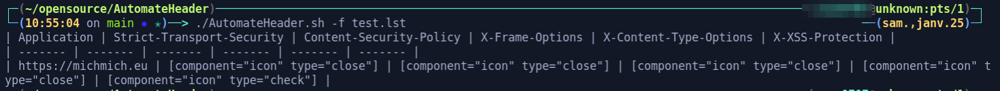
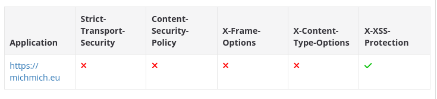

# AutomateHeader
Check Security Header and output at Markdown Format

## How to install and use

`chmod +x ./AutomateHeader.sh && ./AutomateHeader.sh -D ` 

Then, specify the urls you need to check in a file and specify it as an argument, as in the example below 

## Preview

